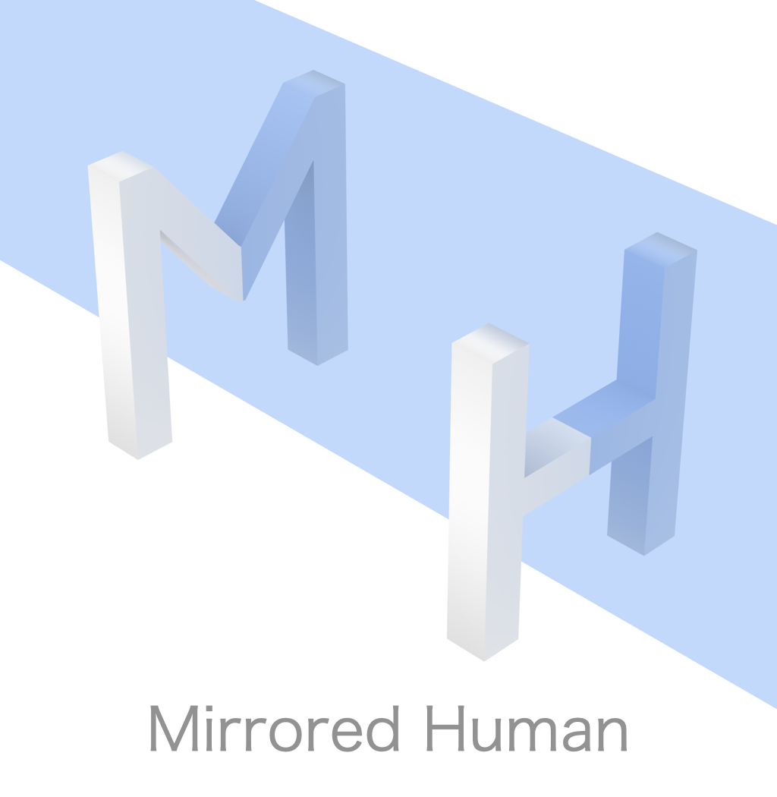
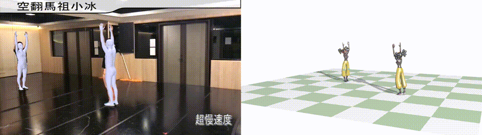
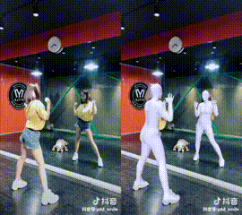
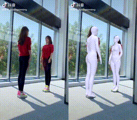
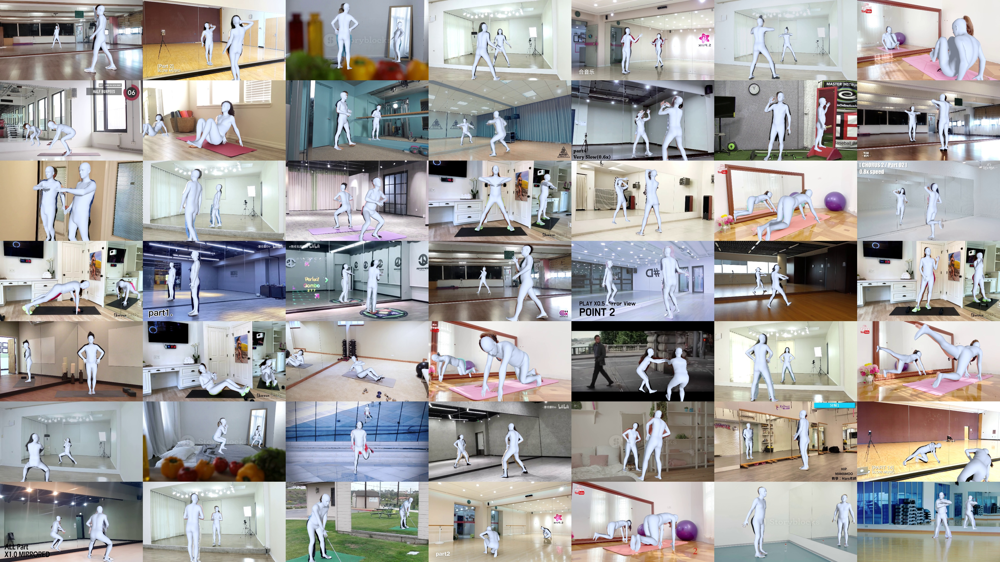
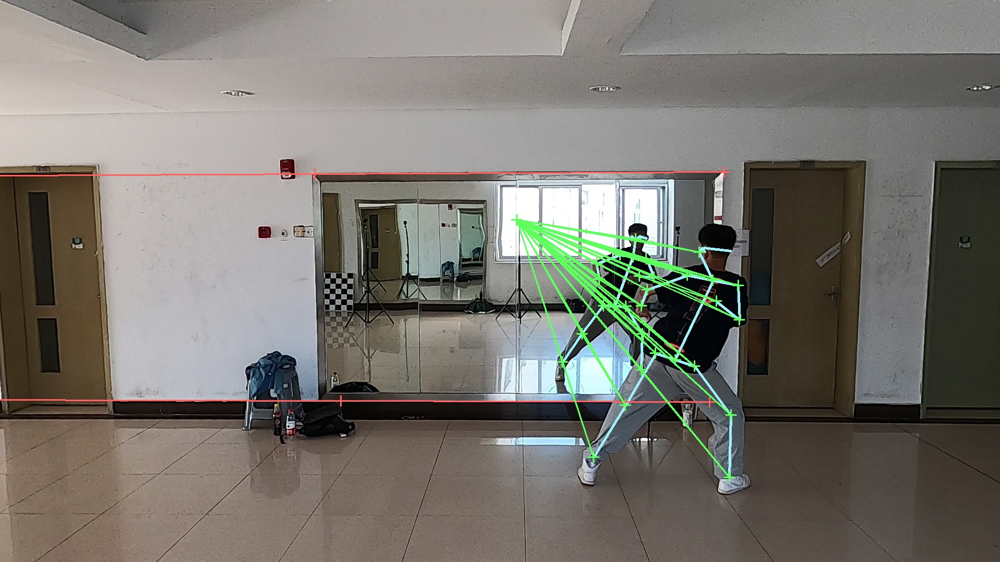
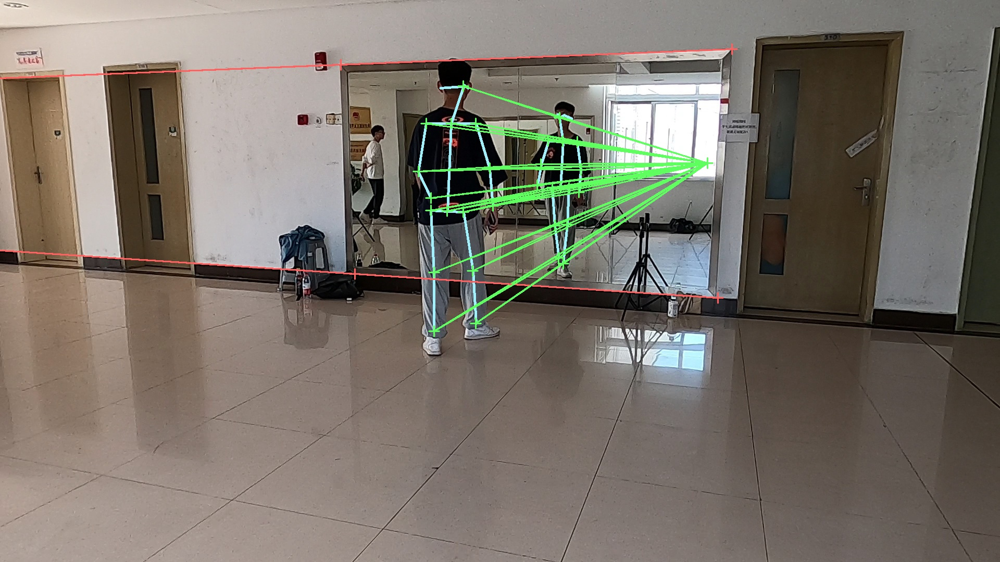
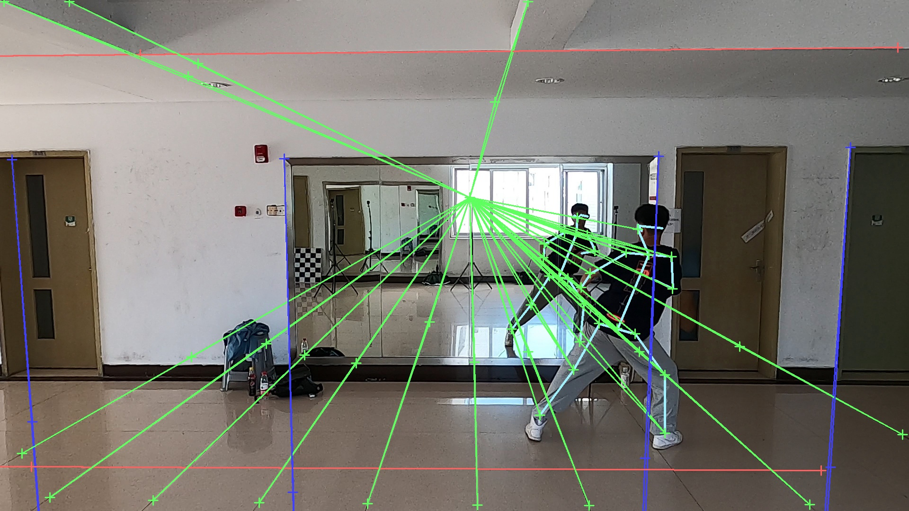
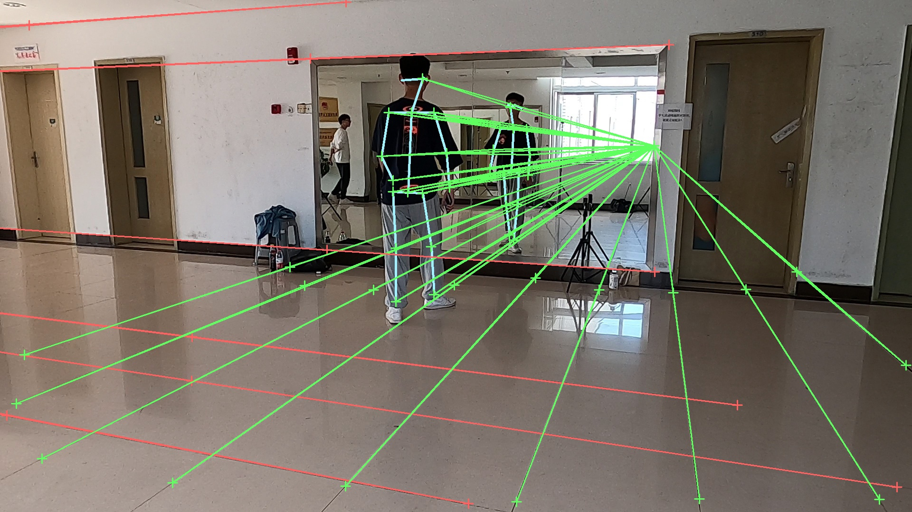
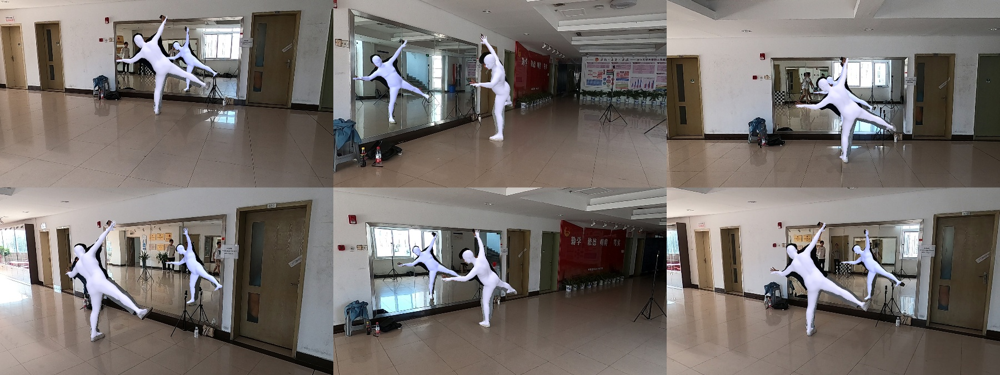

<div align="center">
    
</div>

-----------------

# Reconstructing 3D Human Pose by Watching Humans in the Mirror

> [](https://zju3dv.github.io/Mirrored-Human/) [](https://arxiv.org/pdf/2104.00340.pdf)  
> Qi Fang\*, Qing Shuai\*, Junting Dong, Hujun Bao, Xiaowei Zhou  
> CVPR 2021 Oral

<div align="center">
    
</div>
<div align="center">
    
    
    <br>
    <sup>The videos are from <a href="https://www.youtube.com/watch?v=KOCJJ27hhIE">Youtube<a/> and Douyin. Please contact us for any copyright issue.</sup>
</div>

## News

- The video clips are released as a part of the [ZJU-MoCap](https://chingswy.github.io/Dataset-Demo/) dataset.
- We build a [website](https://chingswy.github.io/Dataset-Demo/mirror-new.html) for a fast preview of our dataset.

## Features  
In this paper, we introduce the new task of reconstructing 3D human pose from a single image in which we can see the person  and the person’s image through a mirror.

This implementation:

- has the demo of our optimization-based approach implemented purely in PyTorch.
- provides a method to estimate the surface normal of the mirror from vanishing points.
- provides an annotator to label the mirror edges for the vanishing points.
- can estimate the focal length of the Internet mirror images.

## Installation  
This repo has a close relation with EasyMocap. Please refer to our [EasyMocap](https://github.com/zju3dv/EasyMocap) project for installation.

## Demo
Download our [zju-m-test.zip](https://www.dropbox.com/s/hk147ov7wc5xzzp/zju-m-demo.zip?dl=0)  and run the following code:
```bash
# set the data path
data=<path_to_sample>/zju-m-demo
out=<path_to_sample>/zju-m-demo-output
# extract the video frames
python3 scripts/preprocess/extract_video.py ${data}
# Run demo on videos
python3 apps/demo/1v1p_mirror.py ${data} --out ${out} --vis_smpl --video
```

## Mirrored-Human Dataset
Due to the license limitation, we cannot share the raw data directly. The video clips including url links and timestamps are released as a part of the [ZJU-MoCap](https://chingswy.github.io/Dataset-Demo/) dataset. The pseudo ground-truth will be released later.

See [Build Your Internet Dataset](#Build-Custom-Internet-Dataset) if you can't wait for our release.

<div align="center">
  
</div>

## Annotator

We also provide the annotator metioned in our paper. 

The first row shows that we label the edges of the mirror and calculate the vanishing point by the human body automaticly. The intrisic camera parameter can be calculated by this two vanishing points.

The second row shows that to obtain a more accurate vanishing points and camera parameters, we can label the parallel lines in the scene, for example the door, the grid in the ground, and the door.

<div align="center">
  
  <br/>
  
  
  
</div>

See [EasyMocap/apps/annotator](doc/annotator.md) for more instructions.

## Build Custom Internet Dataset

See [doc/internet.md](doc/internet.md) for more instructions.

## Build Custom Evaluation Dataset (Multi-View)

This part is provided for the researchers who want to:

1. capture more accurate human motion with multiple cameras and a mirror
2. build a different evaluation dataset

See [doc/custom.md](doc/custom.md) for more instructions.

<div align="center">
  
</div>

## Evaluation

To evaluate the reconstruction part in our paper, see [doc/evaluation.md](doc/evaluation.md).

## Contact  
Please open an issue if you have any questions (prefer issues to emails such that other people could also see it). We appreciate all contributions to improve our project.

If you find some videos that we didn't notice, please tell us.

## Citation

```
@inproceedings{fang2021mirrored,
  title={Reconstructing 3D Human Pose by Watching Humans in the Mirror},
  author={Fang, Qi and Shuai, Qing and Dong, Junting and Bao, Hujun and Zhou, Xiaowei},
  booktitle={CVPR},
  year={2021}
}
```

## Acknowledgement  
This project is build on our [EasyMocap](https://github.com/zju3dv/EasyMocap). We also would like to thank Jianan Zhen and Yuhao Chen for their advice for the paper. Sincere thanks to the performers (Yuji Chen and Hao Xu) in the evaluation dataset and people who uploaded the mirror-human videos to the Internet.
