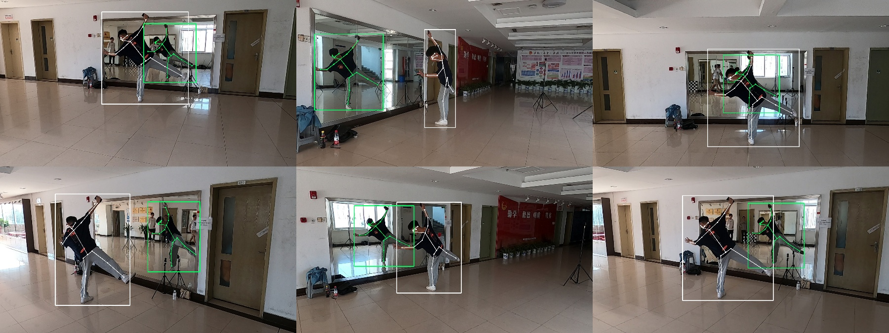

<!--
 * @Date: 2021-03-30 15:01:36
 * @Author: Qing Shuai
 * @LastEditors: Qing Shuai
 * @LastEditTime: 2021-04-14 14:18:42
 * @FilePath: /Mirrored-Human-public/doc/custom.md
-->
# Build Your Custom Dataset

If you want to build a multi-view mirrored-human dataset by yourself, you can follow our instructions.

## 1. Calibrate cameras and mirror and synchronize

The camera calibration is the same as previous multiple cameras systems. 
The difference is that we should know the normal and center of the mirror.
In our implementation, we set the normal of the mirror to `(0, 1, 0)` and distance to the mirror is zero.

## 2. Annotate and track 2D human pose

If there exists only one person in the scene, we set the person ID to 0 and 1 of the person and its mirror image.

## 3. Reconstruct 3D Pose
Set the data path and the output path to `data` and `out` before you do this step.

```bash
python3 apps/demo/mv1p_mirror.py ${data} --out ${out} --annot annots --verbose --vis_smpl --skel --sub_vis 3 --vis_repro --body body15 --vis_det --opts reg_shapes 2e-3 smooth_body 5e-1 smooth_poses 1e-1 reg_poses_zero 1e-3
```

This script will simply triangulate the keypoints from in and out the mirror. Some flags are helpful to check the results:

|flags|help|
|----|----|
|`--vis_det`|visualize the detections|
|`--vis_repro`|visualize the reprojections|

If everything works well, you will see the reprojection of the 3D skeletons like this:



## 4. Reconstrut 3D SMPL

The render results will be like this:


## 5. Visualize
Render the skeleton:
```bash
python3 code/vis_render.py ${data} --skel ${data}/output/keypoints3d --type skel --body body25 --out ${data}/output
```
Render the SMPL mesh:
```bash
python3 code/vis_render.py ${data} --skel ${out}/smpl --type mesh --out ${out}/ --add_back --scene none
```

Render the 3D scene:
```bash
sub=3 # set the view
python3 code/vis_render.py ${data} --skel ${out}/keypoints3d --type skel --body body25 --sub ${sub} --out ${out}/ground --scene ground
python3 code/vis_render.py ${data} --skel ${out}/keypoints3d --type skel --body body25 --sub ${sub} --out ${out}/mirror --scene calib
```
Because pyrender can't render the transparent mirror, we render the images with and without mirror, and blend them.

<p style="text-align:center;">
  
</p>

## 6. Output

More infomation about the output can be found in [EasyMocap/output.md](https://github.com/zju3dv/EasyMocap/blob/master/doc/02_output.md)